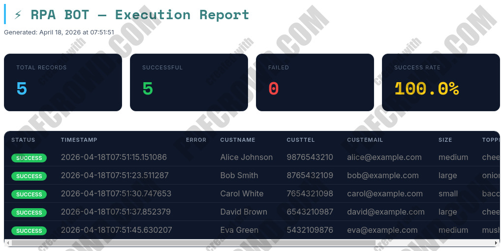
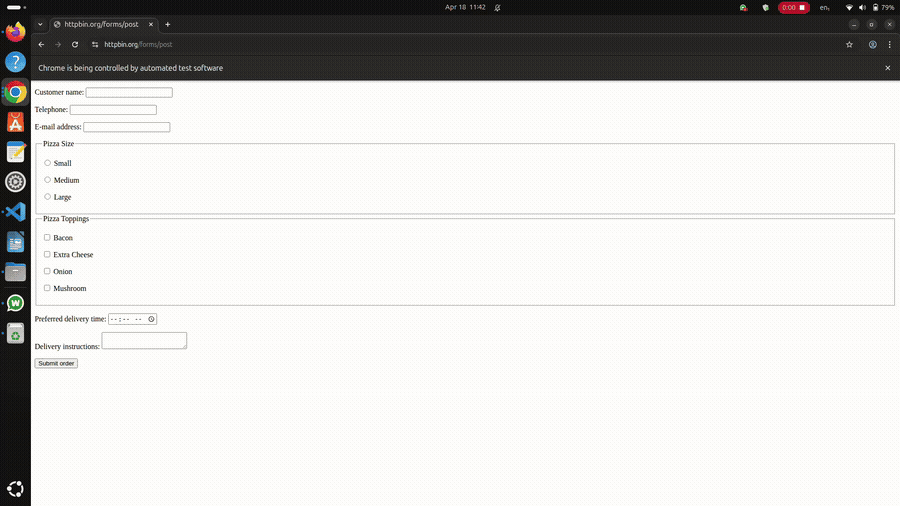

# ⚡ RPA Bot — Python + Selenium Form Automation

An RPA (Robotic Process Automation) bot that reads data from Excel/CSV files and automatically fills and submits web forms using Selenium. Generates styled HTML and Excel reports after each run.

---


## 📁 Project Structure

```
RPA_BOT/
├── core/
│   ├── __init__.py           # Package exports
│   ├── bot_engine.py         # Selenium automation engine
│   ├── data_loader.py        # Excel/CSV reader & validator
│   └── report_generator.py   # HTML + Excel report builder
├── assets/
|   ├──bot_demo.gif           #Automation in Action
|   └──repot_20260418_o75151.html.jpg #Report Preview
├── reports/                  # Auto-created — output reports go here
├── sample_data/
│   └── sample_input.csv      # Example input file
├── config.json               # Bot settings (URL, timeouts, selectors)
├── main.py                   # Entry point — run this
├── requirements.txt          # Python dependencies
└── .codex                    # Internal notes
```

---

## 🚀 Getting Started

### 1. Clone the repository

```bash
git clone https://github.com/YOUR_USERNAME/YOUR_REPO_NAME.git
cd RPA_BOT
```

### 2. Create and activate a virtual environment

```bash
# Create
python -m venv .venv

# Activate (Windows)
.venv\Scripts\activate

# Activate (Mac/Linux)
source .venv/bin/activate
```

### 3. Install dependencies

```bash
pip install -r requirements.txt
```

> **Note:** Chrome must be installed on your machine. The bot uses `webdriver-manager` to automatically download the correct ChromeDriver — no manual setup needed.

### 4. Configure the bot

Edit `config.json` to point to your target form:

```json
{
  "form_url": "https://your-form-url.com",
  "timeout": 15,
  "page_load_delay": 1.5,
  "submit_delay": 2.0,
  "delay_between_records": 1.0,
  "submit_selector": {
    "by": "xpath",
    "value": "//button[contains(text(),'Submit')]"
  }
}
```

### 5. Prepare your input data

Create a CSV or Excel file with columns matching your form fields. See `sample_data/sample_input.csv` for an example:

```
custname, custtel, custemail, size, toppings, delivery, comments
Bob Smith, 8765432109, bob@example.com, large, , 19:00, green onions
...
```

### 6. Run the bot

```bash
python main.py
```
## 🚀 Running the Bot

```bash
python main.py --file sample_data/sample_input.csv --headless
```

### 🔍 What is `--headless`?

The `--headless` flag runs the automation **without opening a visible browser window**.

Instead of launching a GUI browser (like Chrome/Firefox), the bot uses a **headless browser engine** that executes all actions in the background.

---

### ⚙️ What actually happens internally?

When `--headless` is enabled:

* A browser instance is still created (e.g., Chrome via Selenium)
* The browser runs in **headless mode** using flags like:

  ```bash
  --headless=new
  --disable-gpu
  --window-size=1920,1080
  ```
* All DOM interactions (clicks, typing, navigation) still happen exactly the same
* Rendering occurs in memory, not on screen

---

### ✅ Why use headless mode?

* ⚡ **Faster execution** (no UI rendering overhead)
* 🧠 **Lower memory & CPU usage**
* 🤖 **Ideal for automation pipelines / CI-CD**
* 🖥️ **Works on servers without display (Linux, Docker, cloud)**
* 🔒 **More stable for large batch runs**

---

### ❌ When NOT to use it

Avoid `--headless` if you:

* Need to visually debug the automation
* Are troubleshooting element selectors
* Want to watch the bot’s behavior in real time

---

### 🔄 Without headless (Debug Mode)

```bash
python main.py --file sample_data/sample_input.csv
```

This opens a visible browser so you can observe the automation step-by-step.

---

### 🧠 Developer Insight

Headless mode is not “no browser” — it is a **browser without UI**.

Think of it as:

> Full browser engine ✔
> Rendering engine ✔
> UI window ❌

---

### 🏁 Summary

| Mode     | Browser UI | Speed  | Use Case                |
| -------- | ---------- | ------ | ----------------------- |
| Normal   | ✅ Yes      | Medium | Debugging / Development |
| Headless | ❌ No       | Fast   | Automation / Production |

---


Reports will be saved automatically to the `reports/` folder.
## 🎥 Demo

### HTML Report Preview


### Automation in Action



---

## 📊 Reports

After each run, two reports are generated inside `reports/`:

| File | Description |
|------|-------------|
| `report_<timestamp>.html` | Visual dashboard with colour-coded SUCCESS/FAILED rows |
| `report_<timestamp>.xlsx` | Excel file with a Results sheet and a Summary sheet |

**Example summary:**

| Total | Success | Failed | Success Rate |
|-------|---------|--------|--------------|
| 5     | 5       | 0      | 100%          |

---

## ⚙️ How It Works

1. **`DataLoader`** reads the input CSV/Excel file, strips whitespace, drops empty rows, and converts each row into a Python dict.
2. **`RPABotEngine`** launches Chrome, navigates to the form URL for each record, fills all fields (text, dropdown, radio, checkbox, time), and clicks submit.
3. **`ReportGenerator`** collects all results and produces the HTML and Excel reports.

### Supported field types

| Type | Description |
|------|-------------|
| `text` | Regular text input |
| `time` | Time input — auto-converts 12-hour (`08:00 PM`) to 24-hour (`20:00`) |
| `dropdown` | `<select>` elements |
| `radio` | Radio button groups |
| `checkbox` | Checkbox groups (fuzzy matching) |
| `click` | Generic clickable element |

---

## 🛠️ Configuration Reference (`config.json`)

| Key | Default | Description |
|-----|---------|-------------|
| `form_url` | — | URL of the web form to automate |
| `timeout` | `15` | Seconds to wait for elements to appear |
| `page_load_delay` | `1.5` | Seconds to wait after page load |
| `submit_delay` | `2.0` | Seconds to wait after clicking submit |
| `delay_between_records` | `1.0` | Seconds to pause between each row |
| `submit_selector` | — | How to find the submit button (`by` + `value`) |
| `success_url_contains` | — | *(Optional)* URL fragment that confirms success |
| `success_selector` | — | *(Optional)* DOM element that confirms success |

---

## 📦 Dependencies

```
selenium>=4.18.1
webdriver-manager>=4.0.1
pandas>=2.2.0
openpyxl>=3.1.2
```

---

## 💡 Tips

- **Headless mode:** To run without opening a browser window, pass `headless=True` when creating `RPABotEngine` in `main.py`.
- **Required fields:** Mark a field as `"required": true` in your field map — the bot will skip the row and log a FAILED result instead of submitting an incomplete form.
- **Screenshots:** On any failure, the bot automatically saves a screenshot to `reports/` for debugging.
- **Validation errors:** Rows that fail pre-submit validation (e.g. invalid dropdown value) are marked FAILED with the reason logged in the Error column of the report.

---

## 🤝 Contributing

Pull requests are welcome. For major changes, please open an issue first to discuss what you'd like to change.

---

## 📄 License

[MIT](https://choosealicense.com/licenses/mit/)
